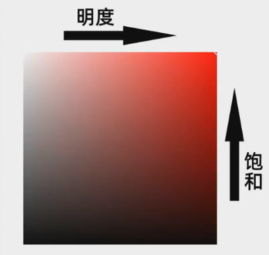
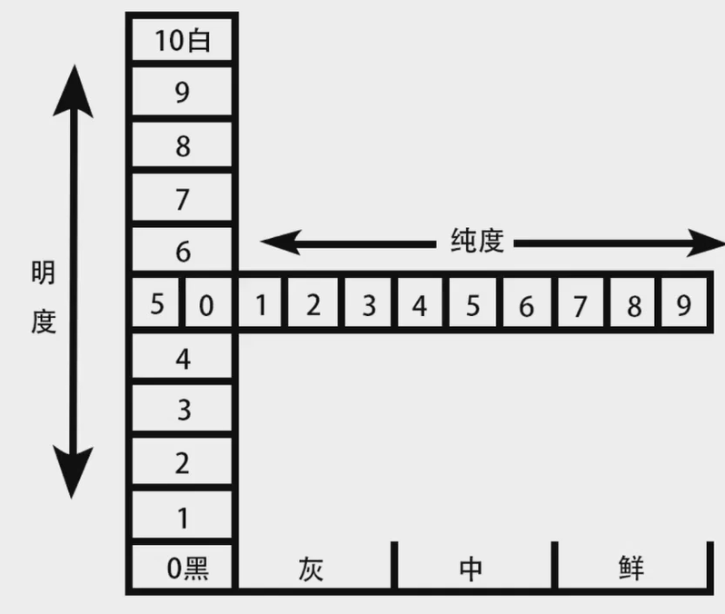
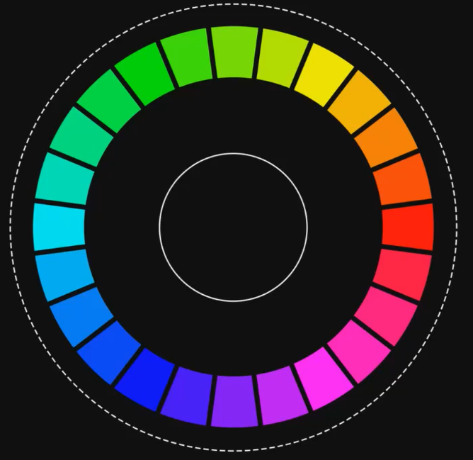

# Color Sense Picker

> 一个面向摄影爱好者和修图初学者的 Windows 桌面取色分析工具。

Color Sense Picker 不只是普通取色器。它可以从屏幕任意位置取色，显示颜色的 RGB、HSV、HSL、CMYK 信息，并进一步判断这个颜色在基础色中的归属程度、色相位置、明度和纯度倾向。

它适合用来分析照片里的主体色、背景色、高光、阴影和肤色，帮助你把“感觉偏绿”“有点发灰”“冷暖对比强”这类主观判断，转成更直观的位置和数值。

## 目录

- [快速开始](#快速开始)
- [核心功能](#核心功能)
- [功能示意](#功能示意)
- [摄影分析流程](#摄影分析流程)
- [摄影色彩基础](#摄影色彩基础)
- [软件适合解决的问题](#软件适合解决的问题)
- [算法说明](#算法说明)

## 快速开始

如果你只想本地使用，直接双击已经打包好的程序：

```text
ColorSensePicker.exe
```

如果你想用源码运行：

```powershell
cd C:\Users\26499\Desktop\hobby\color_sense_picker
python app.py
```

也可以双击：

```text
run_color_picker.bat
```

## 核心功能

| 功能 | 作用 |
| --- | --- |
| 屏幕取色 | 按 `F6` 或点击按钮，从屏幕任意位置读取像素颜色。 |
| 像素预览 | 取色时显示放大网格，方便看清鼠标附近的具体像素。 |
| 颜色信息 | 显示 HEX、RGB、HSV、HSL、CMYK。 |
| 归属程度 | 判断当前颜色更接近红、橙、黄、绿、青、蓝、紫、灰等基础色的程度。 |
| 色相位置 | 在竖向彩虹色带中标出当前颜色所在位置。 |
| 固定位置 | 把当前色相位置固定在色带上，便于连续对比多个取样点。 |
| 清空固定 | 清除所有固定标记，重新开始下一轮照片分析。 |
| 判断目标 | 手动选择一个目标色，观察当前颜色属于该目标色的程度。 |

## 功能示意

### 1. 屏幕取色与 HSV 判断

软件的取色面板参考了常见修图软件的颜色选择逻辑。横向可以理解为饱和度变化，纵向可以理解为明度变化。取色后，软件会把屏幕像素转换成多种颜色格式，并显示它在基础色中的归属程度。

<p align="center">
  
</p>

摄影后期里，颜色不能只看“是什么颜色”，还要看它“亮不亮”和“纯不纯”。同样是绿色，可能是鲜绿、暗绿、灰绿、黄绿。这个软件可以帮助你拆开观察这些差异。

### 2. 明度与纯度

明度决定颜色的亮暗，纯度决定颜色的鲜艳程度。对摄影来说，这两个维度非常重要：它们影响画面的层次、通透感、情绪和主体突出程度。

<p align="center">
  
</p>

举例来说：

- 高明度颜色更轻、更亮，常见于天空、高光、浅色衣物。
- 低明度颜色更重、更暗，常见于阴影、暗部背景。
- 高纯度颜色更鲜艳，更容易抓住视线。
- 低纯度颜色更安静，容易形成高级、柔和、灰调的画面。

### 3. 色相位置与固定对比

色相位置用于判断颜色在完整色相系统中的位置。你可以取一个颜色后点击 `固定位置`，然后继续取其他颜色。多个固定点可以帮助你判断照片里的颜色关系。

<p align="center">
  
</p>

固定多个颜色后，可以这样理解：

| 关系 | 判断方式 | 画面感觉 |
| --- | --- | --- |
| 同类色 | 固定点非常接近 | 统一、柔和、稳定 |
| 邻近色 | 固定点相邻但有一定距离 | 有变化，但整体协调 |
| 对比色 | 固定点距离较远或接近相对 | 冲突更强，视觉张力更大 |
| 冷暖对比 | 蓝青紫与红橙黄同时出现 | 常见于日落、阴影、人像环境光 |
| 低饱和色 | 色相不明显，接近灰白黑 | 更适合结合明度和纯度判断 |

## 摄影分析流程

适合初学者分析一张照片的色彩结构：

1. 打开照片或修图软件，让照片显示在屏幕上。
2. 点击 `屏幕取色 F6`，先取主体颜色，例如人脸、衣服、花朵或建筑。
3. 观察 `最近颜色`、`颜色归属程度` 和 `色相位置`。
4. 点击 `固定位置`，把主体色保存到色相色带上。
5. 继续取背景色、高光、阴影或天空颜色，并分别固定。
6. 对比固定点之间的距离，判断照片是统一配色还是强对比配色。
7. 分析完成后点击 `清空`，开始下一张照片或下一轮修图对比。

## 摄影色彩基础

### 色相

色相就是颜色类别，例如红、橙、黄、绿、青、蓝、紫。摄影里分析色相，可以帮助你判断画面主色调。草地可能偏黄绿，天空可能偏青蓝，傍晚高光可能偏橙红。

### 明度

明度是颜色的亮暗。高明度区域会更轻、更亮，低明度区域会更沉、更暗。分析明度可以帮助你判断画面层次是否清楚，主体是否从背景中分离出来。

### 纯度

纯度可以理解为颜色的鲜艳程度。高纯度颜色更醒目，低纯度颜色更灰、更柔和。风光照片中过高的纯度可能显得不自然，人像照片中过高的橙黄纯度可能让肤色显脏。

### 同类色、邻近色、对比色

同类色让画面统一，邻近色让画面协调但有变化，对比色让画面更有冲击。通过固定多个色相位置，你可以更直观看到照片中的颜色关系，而不是只凭感觉判断。

## 软件适合解决的问题

- 判断一张照片的主色调到底偏向什么颜色。
- 分析天空、草地、肤色、阴影是否出现明显偏色。
- 比较修图前后颜色是否被推得过远。
- 观察一张照片是同类色、邻近色还是对比色构成。
- 训练摄影初学者对明度、纯度、色相的敏感度。
- 帮助建立“颜色位置感”，让后期调色更有依据。

## 算法说明

颜色匹配度基于 CIE Lab 空间的色差：

```text
score = 100 * exp(-(deltaE / 48)^2)
```

这个分数不是严格的物理标准值，而是面向摄影分析和交互观察的直观“相似程度”。后续可以把 `PALETTE` 换成品牌色、服装色卡、工业标准色卡，或者把 `similarity_score` 调整成更严格的阈值模型。
